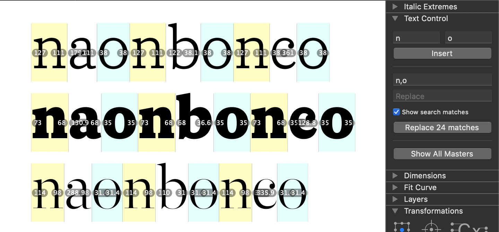

# TextControl

Glyphs app plugin to add text manipulation functionalities to the Edit tab.

### How to use

The plugin can be used on all content of an Edit tab or on selected text only.

All inputs must follow the slashed glyph names syntax, ex: /n/ampersand/o *first glyphname can omit the slash for convenience*

**Left** and **Right** fields are used to insert control characters to the left and right side of every glyph from the Edit tab (or selection).
Multiple glyphs can be entered, each left and right glyph will be from the master of the center glyph.

The **Search** and **Replace** fields can take in multiple slashed strings separated by commas, ex: /n/o,/o/n
The number of searches must match the numbers of replacements or the plugin will raise an error.

### To do

1. add a wildcard option to target all suffixed glyphs, ex: \*.alt Figure out the different possible patterns: sub *\*.suffix1* by *\*.suffix2*, sub *a.suffix1,b.suffix2* by *\*.suffix3*...
2. fix lineheight calculation for highlighting
3. fix errors in highlighting for selected/unselected glyphs
4. Move the search matches number calculation out of the drawing function to have it even with highlighting disabled

### License

Copyright 2020 Joachim Vu.

Based on the Glyphs plugin SDK sample code by Georg Seifert (@schriftgestalt).

Licensed under the Apache License, Version 2.0 (the "License");
you may not use this file except in compliance with the License.
You may obtain a copy of the License at

http://www.apache.org/licenses/LICENSE-2.0

See the License file included in this repository for further details.